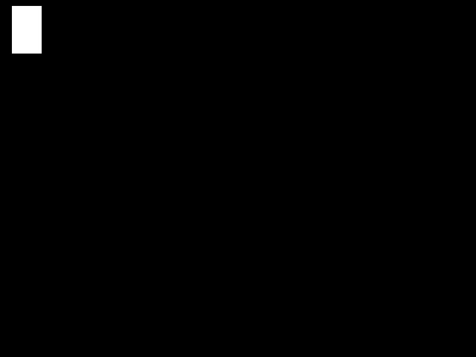
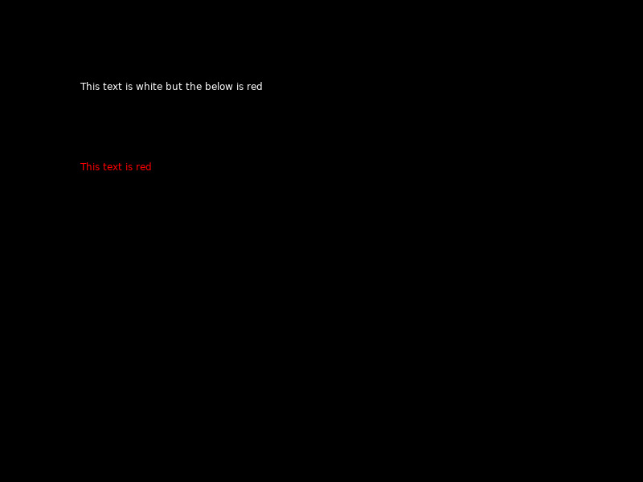
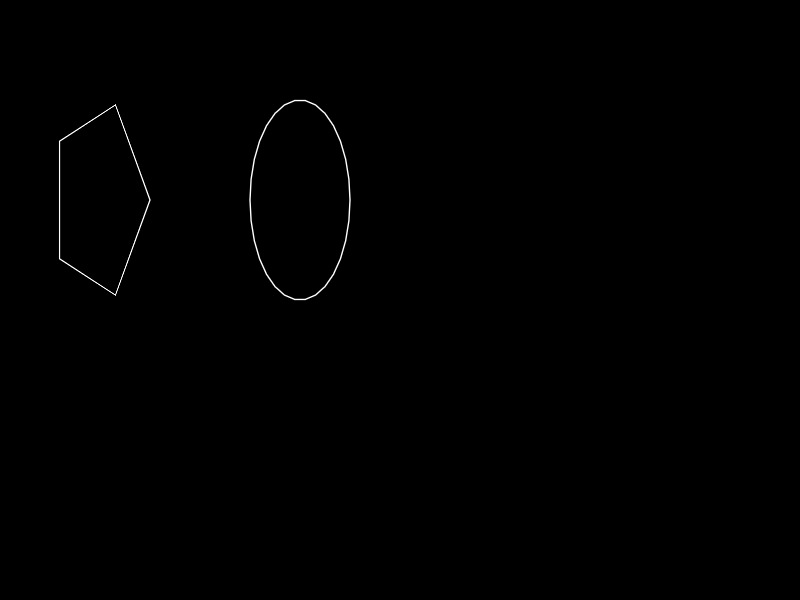
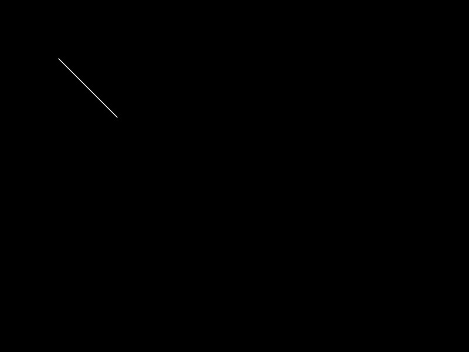
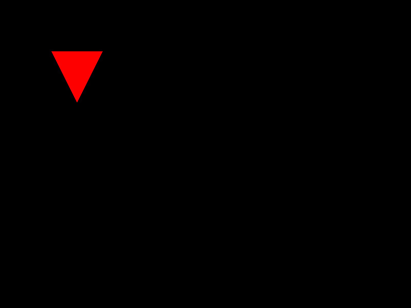
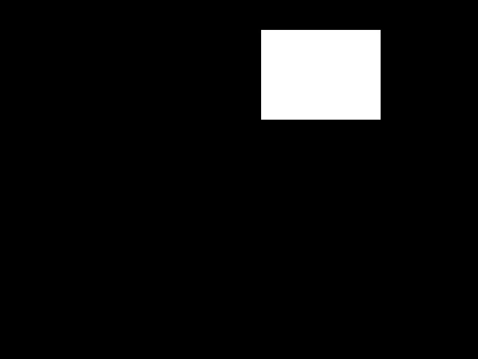
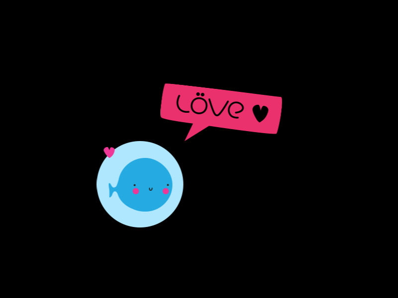
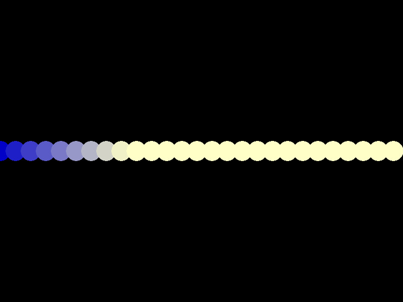

# From Processing (and p5.js) to LÖVE

Notes and examples for getting started coding in [LÖVE](https://love2d.org/) (aka Love2d) for folks with previous experience in Processing, p5.js and the like.

This introduction assumes you have some previous experience in programming with Processing or p5.js and are curious about LÖVE and Lua. This is not a comprehensive tutorial for Lua or even LÖVE but simply an entry point.

### What is LÖVE?

LÖVE is a free, open source framework to make games in the Lua language and works on Mac, Windows, Linux, iOS, Android. There is a [wiki](https://love2d.org/wiki/Main_Page) with documentation, including a reference and a number of [additional libraries](https://love2d.org/wiki/Category:Libraries) and tutorials.

Just as p5.js is a library in Javascript and Processing is a framework in Java, LÖVE is a framework built on top of the popular programming language Lua. Lua is about 30 years old, developed originally in Brazil, and noted for its speed, portability across operating systems, ease-of-use, and an emphasis on scripting as an extension language.

### Why use LÖVE?

Although LÖVE contains libraries for drawing to the screen similar to Processing, it is intended for the creation of games. It is particularly useful for making 2d games with tiles.

You may also want to use LÖVE if you're interested in trying something new, learning a new language that is applicable to many other tools (Roblox, Playdate, Pico-8, Tic-80, and many more), and interested in a program that works fast and is cross-compatible on many computers. 

### Who makes LÖVE?

LÖVE was originally released in 2008. The developers are listed as Anjo, Bartbes, Rude, Slime, Vrld. The project is collaboratively managed on [GitHub](https://github.com/love2d/love) with additional contributions from dozens of other contributors.

### Download LÖVE

LÖVE can be downloaded from its [website](https://love2d.org/). Choose the download for your specific operating system.

## Creating and running your LÖVE program

In p5.js, your sketch is generally a file called sketch.js. In Processing, your program is a custom file name you choose and ends in .pde.

In Processing, you may have coded in the Processing IDE. For p5.js you may have coded with the free online web editor. For LÖVE, there is no special program for creating LÖVE games. You can use any code editing program. If you have no previous experience, you could try installing [Atom](https://atom.io). Open up the preferences > install. Type in Language-lua and install the package that mentions that name. It will provide syntax highlighting to any file named and saved with a .lua extension.

In your desktop, command line or inside your code editor create a new folder for your game or program. In that folder you should name your program ```main.lua```. Other assets like images, fonts, sounds can be stored in the folder as well. 

There are multiple ways to run a love program. **The easiest way to run your program is to drop the whole folder containing your main.lua file and any other assets onto the LÖVE application (also called an *executable* on Windows).** Some code editors will also be able to automatically run and launch love programs. For Linux and command line users, check out the [Getting Started](https://love2d.org/wiki/Getting_Started) for additional options of setting up and running LÖVE programs or a list of code editors that can run LÖVE directly.

### Hello World

Let's create a basic hello world program to test we're up and running.

Save this into your main.lua:

```lua
function love.draw()
  love.graphics.print('Hello World!', 400, 300)
end
```

Then drag and drop the *folder* holding this file (not the main.lua file itself) onto your LÖVE application to launch it.

  
*Black screen with white text "hello world" roughly in the center*  

I'm on Linux running in the command line so to run this I can simply run ```love .``` inside that folder to launch it. (See the [getting started](https://love2d.org/wiki/Getting_Started) for more options)

### Default window size

Let's get some graphics onto the screen

In Processing, you may be aware there are hidden defaults. If you don't specify a ```size()``` then your sketch runs in a 100 by 100 pixel area. In p5.js, if you don't specify a size in ```createCanvas()``` then your sketch's canvas is also 100 by 100 pixels.

Since we didn't specify a size in our hello world program above it assumed a default window size of 800 by 600 pixels.  

### A More Processing-like first program

Let's get some shapes onto the screen.

In Processing and p5.js we might write a basic program like this:

```js
//p5.js code
function draw(){
  rect(20,10,50,80);
}
```

In p5.js no setup means that a default canvas size of 100 by 100 will be created. No fill specified means the background will be white and the rectangle will have a black outline with white fill by default.

Let's write a similar program in LÖVE.  You can erase the previous main.lua and try this

```lua
function love.draw()
    love.graphics.rectangle("fill", 20, 10, 50, 80)
end
```

Now save and run this program (drag the folder onto the LÖVE application or run in the command line). If you have no errors you should see a black window 600 pixels wide by 800 pixels high with a white rectangle in the upper left corner. These colors and screen size are the defaults for LÖVE.

  
*A white rectangle in the top left corner of a black screen*  

### A bite of syntax

To write a comment in LÖVE, we put ```--``` at the beginning of the line.

```lua
-- This is a comment
```

We can do multi-line comments in Lua, particularly useful for turning on and off sections of our code when we're debugging.

```lua
--[[
An example of a 
multi-line comment.
--]]
```

*You'll notice that most commands in LÖVE start with ```love.```* This helps distinguish LÖVE-specific functions from general Lua commands and your own custom written functions. It is a different approach from Processing or p5.js (for example, you don't have to write ```p5.ellipse(100,50,200,50);``` in p5.js.

In general, you'll notice LÖVE (and Lua, the language it's built on) does away with curly brackets and the like in favor of ending blocks of code with the word *end*.

### Working in color

In Processing or p5.js you can write ```fill(number)``` to specify a grayscale value. In LÖVE you must specify all three R,G,B values. **Unlike Processing, in current version of LÖVE color values must vary from 0 to 1 instead of 0 to 255.**

```lua
--to set a black fill
love.graphics.setColor(0,0,0)
```

An example:

```lua
function love.draw()
   --set to white
   love.graphics.setColor(1,1,1)
   love.graphics.print("This text is white but the below is red", 100, 100)
   
   --set to red
   love.graphics.setColor(1,0,0)
   love.graphics.print("This text is red", 100, 200)
end
```



To set a background color we use the clear command. This resets to a black transparent background, e.g. to the color (0,0,0,0).

```lua
function love.draw()
  love.graphics.clear()
end
```

If we want to specify a background color we can use R, G, B and optionally set an alpha (transparency). 

To set a background color of green:

```lua
function love.draw()
  love.graphics.clear(0,1,0)
end
```

### other Shapes

Ellipse:

```lua
function love.draw()
  love.graphics.ellipse( mode, x, y, radiusx, radiusy, segments )
end
```

Unlike in Processing and p5.js you must specify the *mode*, either *fill* or *line*. In Processing and p5.js you specify the width and height. In LÖVE you specify the radius (half of each of these). The segments is optional, the number of segments used to draw the ellipse.

Example ellipses:

```lua
function love.draw()
  love.graphics.ellipse("line",100,200,50,100,5)

  love.graphics.ellipse("line",300,200,50,100,30)
end
```

  
*Two ellipses on a black screen. The ellipses on the left is made up of less line segments than the ellipses on the right.*  

Run the program and notice the difference in how the ellipses are drawn based on the larger number of segments used in the second ellipse.

Line:

```lua
function love.draw()
  love.graphics.line(100, 100, 200, 200)
end
```

  
*a white line from the top left corner down and to the right*  

Many additional shapes (triangle, quads, etc) can be created using the polygon function.

```lua
function love.draw()
  love.graphics.setColor(1,0,0)

  love.graphics.polygon("fill", 100,100, 200,100, 150,200)
end
```

  
*red equilateral triangle on a black screen*  

More shapes can be found in the [drawing](https://love2d.org/wiki/love.graphics) section of the LÖVE Wiki.

### Basic structure of a LÖVE program

In Processing and p5.js we usually have setup and draw functions. In LÖVE, we have load, update and draw.

The function ```love.load()``` runs once when the program starts, similar to the setup function in Processing and p5.js.

The function ```love.update(dt)``` runs continously until our program ends. This is where we may call our own custom functions from, take input, or otherwise control our program. You may have noticed that update takes an argument *dt*. That stands for *delta time*. This is the number of seconds since the last time the update run. It is used to precisely calculate the exact amount of time and make adjustments, one of the things that makes LÖVE particularly good for video games, where precision of time (for a clock, reaching a goal, physics, etc) is important.

Finally, ```love.draw()``` happens immediately after our update and this is where we draw any graphics to the screen. In Processing and p5.js these two functions are combined together but LÖVE has us separate the two. **Graphics can only be drawn to the screen in love.draw()**. In fact, as you've seen in our previous example programs, you can have a love.draw() without a love.load() or love.update(), but without love.draw() you won't be able to see anything on screen.

### Variables

Unlike Processing but similar to p5.js, you do not need to specify a variable's type.

**Unlike Processing and p5.js, all variables are global, even those created inside functions, unless specified as local-only**.

Javascript and Java have the ++ shortcut, known as *syntactic sugar* to increment a variable. Lua does not.

```lua
function love.load()
    x = 0 
end

function love.update(dt)
  x=x+1
end

function love.draw()
  love.graphics.setBackgroundColor(0,0,0,0)
  love.graphics.setColor(1,0,0)
  love.graphics.print("x: "..x, 100, 200)
end
```

  
*screenshot of running sketch*  

### Functions

LÖVE (and Lua in general) does not use curly brackets to surround functions, conditionals and loops for example.

Instead of a curly bracket a function in LÖVE ends with the word ```end```.

```lua
function myFunctionName(argument)
  -- function code in here
end
```

In addition to the love.load(), love.update() and love.draw() built-in functions there are also:
* love.mousePressed()
* love.mouseReleased()
* love.keyPressed()
* love.keyReleased()
* love.focus() - anything in this function runs when a user clicks outside the game's running window
* love.quit() - runs once when a user clicks the close button or chooses Quit

All of these function run as a result of an event triggering. 

There are many other [callback functions](https://love2d.org/wiki/Category:Callbacks) available in LÖVE as well as a [tutorial](https://love2d.org/wiki/Tutorial:Callback_Functions) with examples.

### Example of motion

```lua
-- example moving a shape on screen
function love.load()
    x = 100 
end

function love.update()
  x=x+1
end

function love.draw()
    love.graphics.rectangle("fill", x, 50, 200, 150)
end
```

  
*screenshot of a moving white rectangle on a black background*  

### Syntax of conditionals and loops

Conditionals such as an if statement in LÖVE come from Lua. They are similar to conditionals in other languages, bearing in mind that the conditional block ends with the word ```end``` instead of curly brackets.

```lua
function love.load()
  x = 0
  width=love.graphics.getWidth()
  height=love.graphics.getHeight()
end

function love.update()
  x=x+10
  if x > width then
    x = 0
  end
end

function love.draw()
  love.graphics.ellipse("fill",x,height/2,10,10)
end
```

LÖVE (and Lua) also permit use of complex [if-then-elseif-else](https://www.tutorialspoint.com/lua/if_else_statement_in_lua.htm) structure, but there is no equivalent to Javascript's Switch.

### Using the mouse

In Processing and p5.js we are used to the mouseX and mouseY built-in variables for getting the location of the mouse's X and Y coordinates.

LÖVE provides the getX() and getY() functions.

```lua
function love.draw()
  --move mouse on screen to see result
  local x = love.mouse.getX()
  love.graphics.line(x,0, x,love.graphics.getHeight())
end
```

### Random values

Like Processing and p5.js, LÖVE provides a function for generating pseudorandom values.

```love.math.random()``` returns a float between 0 and 1. 


```love.math.random(value)``` returns an integer between 1 and the entered value, inclusive.

```love.math.random(min,max)``` returns an integer between the minimum and the maximum values entered, inclusive. 

**Important**: Unlike Processing and p5.js, LÖVE doesn't seed the random number generator by default. This means that it will always return the same random numbers if you run the same code! Since most of the time you may want different random numbers each time you run your software, simply add the following line near the beginning of your `love.load()` function, which will use the current time to seed the random number generator.

```lua
math.randomseed(os.time())
```

### Example demonstrating keypressed function, conditionals and random number generation and LÖVE syntax

In this example pressing a space key down chooses a new random number for x, used to draw an ellipse in love.draw()

```lua
function love.load()
  x = love.graphics.getWidth()/2
end
function love.keypressed(key)
  if key == 'space' then
    x = love.math.random(love.graphics.getWidth())
  end
end
function love.draw()
  love.graphics.ellipse("line",x,love.graphics.getHeight()/2,20,20)
end
```

### Drawing Images to screen

Like Processing and p5.js, LÖVE has functionality built in to easily import images.

We load an image to a variable using love.graphics.newImage() in the love.load() function. We draw it to the screen using love.graphics.draw() in the love.draw() function.

Images are objects, so we can optionally use :getWidth() and :getHeight().

**The color of an image is affected by any previous setColor() command**.

```lua
function love.load()
  --load image logo.png inside current folder to img
  img = love.graphics.newImage("logo.png") 
  -- make cursor invisible
  love.mouse.setVisible(false)
end

function love.draw()
  -- get mouse coordinates
  local x, y = love.mouse.getPosition() 

  --draw img centered on mouse's coordinates
  love.graphics.draw(img, x - img:getWidth()/2, y - img:getHeight()/2) 
end
```

  
*screenshot of LÖVE's logo moving based on mouse coordinates*  

## More differences from Processing (Java) and p5.js (Javascript)

### String Concatenation

To combine strings of letters together we use the ```..``` syntax.

```js
//this is p5.js
text("My name is "+name,50,50);
```

```lua
--This is the equivalent in LÖVE
love.graphics.print("My name is "..name, 50, 50)
```

### For-Loops

```lua
for counter=init,max_value,amount_to_increment
do
   --action to do in the loop
end
```

The amount_to_increment is optional if the amount is 1.

Example of a for-loop:

```lua
function love.load()
  width = love.graphics.getWidth()
end

function love.draw()
  for i = 1,width,30
  do 
     love.graphics.setColor(i/255,i/255,200/255)
     love.graphics.ellipse("fill",i,300,20,20)
  end
end
```

  
*a black background with ellipses in a gradient running blue to pale yellow across the screen*  

### Arrays and Classes via Tables

Tables are the main data structure of Lua. They work like *dictionaries* with a key and value. We can create many structures like arrays and classes from tables.

To create a table that works like a literal array:

```lua
animals = {"croc","bug","wolf","fox"}
```

**All arrays are 1-indexed!** In the above example, ```animals[1]``` is "croc".

To get an array length, use #.

```lua
total_animals = #animals 
```

Tables can be used similar to Javascript objects.

Classes are a bit beyond the scope of this introduction. Like arrays they are also created out of tables. There are several approaches. Check out the [Classes](https://sheepolution.com/learn/book/11) tutorial in the How to LÖVE online book.

### To distribute programs

When you're ready to distribute your program you will zip up the folder and rename the extension .zip to .love to create an executable Windows exe file, a Mac App, or Linux AppImage. [additional info](https://love2d.org/wiki/Game_Distribution#Create_a_.love-file)

### Built-in functionality in LÖVE

* [Physics](https://love2d.org/wiki/love.physics)
* [Collision detections](https://love2d.org/wiki/Tutorial:PhysicsCollisionCallbacks)  
* [Joystick support](https://love2d.org/wiki/love.joystick)
* Access to the [operating system](https://love2d.org/wiki/love.system) and [file system](https://love2d.org/wiki/love.filesystem) 
* [Video](https://love2d.org/wiki/love.video)
* [Audio](https://love2d.org/wiki/love.audio)
* [Fullscreen](https://love2d.org/wiki/love.window.setFullscreen)
* [Packaging programs for distribution](https://love2d.org/wiki/Game_Distribution)

### Resources

* [LÖVE Wiki](https://love2d.org/wiki/Main_Page) - contains the reference, tutorials, etc
* [LÖVE Forums](https://love2d.org/forums/) 
* [LÖVE Discord server](https://discord.com/invite/rhUets9)  
* [Awesome LÖVE](https://github.com/love2d-community/awesome-love2d) - "A categorized community-driven collection of high-quality, awesome LÖVE libraries, projects, and resources."
* [Obey_love](https://twitter.com/obey_love) official Twitter account of LÖVE
* Tutorial on setting up LÖVE in [Visual Studio Code](https://twitter.com/obey_love) 

### Tutorials

* [How to LÖVE](https://sheepolution.com/learn/book/contents) comprehensive and beginner-friendly book on LÖVE by Sheepolution 
* [Conditionals](https://sheepolution.com/learn/book/6), [Tables and For-Loops](https://sheepolution.com/learn/book/7), [Classes](https://sheepolution.com/learn/book/11) from How To LÖVE
* [Falling in LÖVE with Lua](https://www.youtube.com/watch?v=3k4CMAaNCuk) YouTube video and [slides](https://docs.google.com/presentation/d/1K3GN5827gbqQZJzKu43kXPaW2cTkJWja8WWbrv2Wnmc/edit#slide=id.p), a tutorial on building a basic procedurally generated version of Mario in LÖVE
* Basic [Physics tutorial](https://love2d.org/wiki/Tutorial:Physics)
* LÖVE [Tile Tutorial](https://github.com/kikito/love-tile-tutorial/wiki) to make  tile-based game

## Contributing

I mostly have experience with Processing and p5.js and more limited experience with LÖVE and Lua. Feel free to submit an issue, pull request or get in touch via email with any corrections or suggestions.

# License

This tutorial is Public Domain under The Unlicense except where any code examples from LÖVE are used, under the GNU Free Documentation License 1.3.
